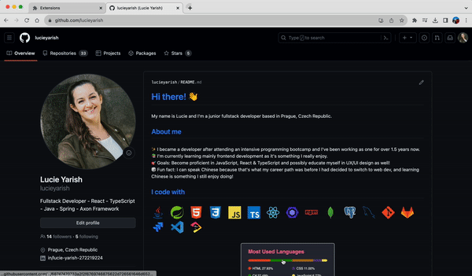

# URL Manager Chrome Extension

📁 Chrome extension for saving URLs. Option to choose between saving the currently opened tab and inserting the desired link.

## About the project

While working on this project via Scrimba's Frontend Developer Career Path, I learned/practiced some of the very important JavaScript concepts:

- `const`
- `addEventListener()`
- `innerHTML`
- `input.value`
- function parameters and arguments
- template literals
- `localStorage`
- the JSON object, `JSON.stringify()` and `JSON.parse()`
- what `manifest.json` is
- objects in arrays

## Try it out!

If you'd like to try the extension out in your browser, follow these steps:

1. Click on the green "Code" button in this repository and select "Download ZIP" option
2. Navigate to `chrome://extensions`
3. In the top right corner, toggle the "Developer mode" button
4. Then select the "Load unpacked" option in the top left corner and upload the downloaded and unzipped `url-manager-chrome-extension` folder
5. That's it! Now you can view your current Extensions by clicking the "puzzle" button (right next to the search bar) in your Chrome, click on the URL manager extension and start saving your favorite tabs!
